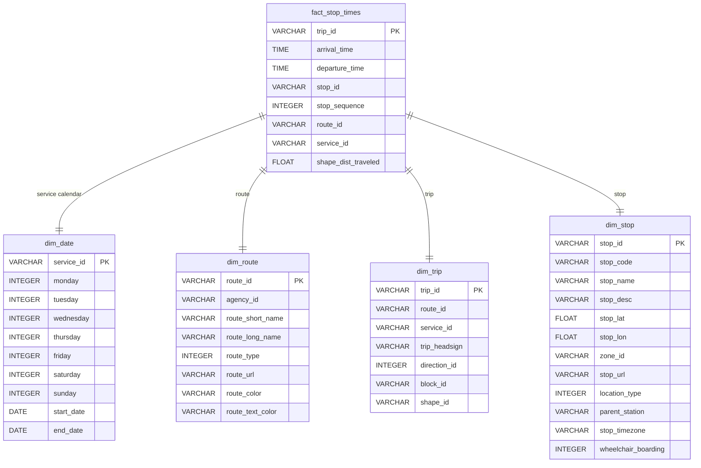

# GTFS Snowflake & Power BI Candidate Homework README

This document outlines **all Snowflake SQL scripts** executed for the Senior Business Analyst take‑home assignment, following the original GTFS specification. It covers environment setup, raw ingestion, data modeling (dimensions & fact), Streams & Tasks implementation, performance tuning, and the star schema design.

---

## 1. Environment Setup

```sql
-- 1.1 Create Warehouse, Database, Schema
CREATE OR REPLACE WAREHOUSE GTFS_WH
  WITH WAREHOUSE_SIZE = 'XSMALL'
  AUTO_SUSPEND = 300
  AUTO_RESUME = TRUE;

CREATE OR REPLACE DATABASE GTFS_DB;
USE GTFS_DB.PUBLIC;

-- 1.2 Create Internal Stage for GTFS CSVs
CREATE OR REPLACE STAGE GTFS_STAGE;
```

---

## 2. Raw Ingestion: COPY INTO Raw Tables

For each GTFS CSV, I created a `raw_*` table and loaded it using `COPY INTO`:

```sql
-- 2.1 Raw Agency
CREATE OR REPLACE TABLE raw_agency (
  agency_id           VARCHAR,
  agency_name         VARCHAR,
  agency_url          VARCHAR,
  agency_timezone     VARCHAR,
  agency_lang         VARCHAR,
  agency_phone        VARCHAR,
  agency_fare_url     VARCHAR,
  agency_email        VARCHAR
);

COPY INTO raw_agency
FROM @GTFS_STAGE/agency.txt
FILE_FORMAT = (
  TYPE                   = 'CSV',
  FIELD_OPTIONALLY_ENCLOSED_BY = '"',
  SKIP_HEADER            = 1
);

-- 2.2 Raw Stops
CREATE OR REPLACE TABLE raw_stops (
  stop_id             VARCHAR,
  stop_code           VARCHAR,
  stop_name           VARCHAR,
  stop_desc           VARCHAR,
  stop_lat            FLOAT,
  stop_lon            FLOAT,
  zone_id             VARCHAR,
  stop_url            VARCHAR,
  location_type       INTEGER,
  parent_station      VARCHAR,
  stop_timezone       VARCHAR,
  wheelchair_boarding INTEGER
);

COPY INTO raw_stops
FROM @GTFS_STAGE/stops.txt
FILE_FORMAT = (
  TYPE                   = 'CSV',
  FIELD_OPTIONALLY_ENCLOSED_BY = '"',
  SKIP_HEADER            = 1
);

-- 2.3 Raw Routes
CREATE OR REPLACE TABLE raw_routes (
  route_id          VARCHAR,
  agency_id         VARCHAR,
  route_short_name  VARCHAR,
  route_long_name   VARCHAR,
  route_type        INTEGER,
  route_url         VARCHAR,
  route_color       VARCHAR,
  route_text_color  VARCHAR
);

COPY INTO raw_routes
FROM @GTFS_STAGE/routes.txt
FILE_FORMAT = (
  TYPE                   = 'CSV',
  FIELD_OPTIONALLY_ENCLOSED_BY = '"',
  SKIP_HEADER            = 1
);

-- 2.4 Raw Trips
CREATE OR REPLACE TABLE raw_trips (
  route_id        VARCHAR,
  service_id      VARCHAR,
  trip_id         VARCHAR,
  trip_headsign   VARCHAR,
  direction_id    INTEGER,
  block_id        VARCHAR,
  shape_id        VARCHAR
);

COPY INTO raw_trips
FROM @GTFS_STAGE/trips.txt
FILE_FORMAT = (
  TYPE                   = 'CSV',
  FIELD_OPTIONALLY_ENCLOSED_BY = '"',
  SKIP_HEADER            = 1
);

-- 2.5 Raw Stop Times
CREATE OR REPLACE TABLE raw_stop_times (
  trip_id            VARCHAR,
  arrival_time       VARCHAR,
  departure_time     VARCHAR,
  stop_id            VARCHAR,
  stop_sequence      INTEGER,
  stop_headsign      VARCHAR,
  pickup_type        INTEGER,
  drop_off_type      INTEGER,
  shape_dist_traveled FLOAT
);

COPY INTO raw_stop_times
FROM @GTFS_STAGE/stop_times.txt
FILE_FORMAT = (
  TYPE                   = 'CSV',
  FIELD_OPTIONALLY_ENCLOSED_BY = '"',
  SKIP_HEADER            = 1
);

-- 2.6 Raw Calendar
CREATE OR REPLACE TABLE raw_calendar (
  service_id VARCHAR,
  monday     INTEGER,
  tuesday    INTEGER,
  wednesday  INTEGER,
  thursday   INTEGER,
  friday     INTEGER,
  saturday   INTEGER,
  sunday     INTEGER,
  start_date VARCHAR,
  end_date   VARCHAR
);

COPY INTO raw_calendar
FROM @GTFS_STAGE/calendar.txt
FILE_FORMAT = (
  TYPE                   = 'CSV',
  FIELD_OPTIONALLY_ENCLOSED_BY = '"',
  SKIP_HEADER            = 1
);

-- 2.7 Raw Calendar Dates
CREATE OR REPLACE TABLE raw_calendar_dates (
  service_id     VARCHAR,
  date           VARCHAR,
  exception_type INTEGER
);

COPY INTO raw_calendar_dates
FROM @GTFS_STAGE/calendar_dates.txt
FILE_FORMAT = (
  TYPE                   = 'CSV',
  FIELD_OPTIONALLY_ENCLOSED_BY = '"',
  SKIP_HEADER            = 1
);

-- 2.8 Raw Fare Attributes
CREATE OR REPLACE TABLE raw_fare_attributes (
  fare_id           VARCHAR,
  price             FLOAT,
  currency_type     VARCHAR,
  payment_method    INTEGER,
  transfers         INTEGER,
  transfer_duration INTEGER
);

COPY INTO raw_fare_attributes
FROM @GTFS_STAGE/fare_attributes.txt
FILE_FORMAT = (
  TYPE                   = 'CSV',
  FIELD_OPTIONALLY_ENCLOSED_BY = '"',
  SKIP_HEADER            = 1
);

-- 2.9 Raw Fare Rules
CREATE OR REPLACE TABLE raw_fare_rules (
  fare_id        VARCHAR,
  route_id       VARCHAR,
  origin_id      VARCHAR,
  destination_id VARCHAR,
  contains_id    VARCHAR
);

COPY INTO raw_fare_rules
FROM @GTFS_STAGE/fare_rules.txt
FILE_FORMAT = (
  TYPE                   = 'CSV',
  FIELD_OPTIONALLY_ENCLOSED_BY = '"',
  SKIP_HEADER            = 1
);

-- 2.10 Raw Feed Info
CREATE OR REPLACE TABLE raw_feed_info (
  feed_publisher_name VARCHAR,
  feed_publisher_url  VARCHAR,
  feed_lang           VARCHAR,
  feed_start_date     VARCHAR,
  feed_end_date       VARCHAR,
  feed_version        VARCHAR
);

COPY INTO raw_feed_info
FROM @GTFS_STAGE/feed_info.txt
FILE_FORMAT = (
  TYPE                   = 'CSV',
  FIELD_OPTIONALLY_ENCLOSED_BY = '"',
  SKIP_HEADER            = 1
);

-- 2.11 Raw Shapes
CREATE OR REPLACE TABLE raw_shapes (
  shape_id            VARCHAR,
  shape_pt_lat        FLOAT,
  shape_pt_lon        FLOAT,
  shape_pt_sequence   INTEGER,
  shape_dist_traveled FLOAT
);

COPY INTO raw_shapes
FROM @GTFS_STAGE/shapes.txt
FILE_FORMAT = (
  TYPE                   = 'CSV',
  FIELD_OPTIONALLY_ENCLOSED_BY = '"',
  SKIP_HEADER            = 1
);
```

---

## 3. Data Modeling & Transformation

### 3.1 Dimension Tables

```sql
-- 3.1.1 Service Calendar Dimension (Dim_Date)
CREATE OR REPLACE TABLE Dim_Date AS
SELECT
  service_id,
  monday,
  tuesday,
  wednesday,
  thursday,
  friday,
  saturday,
  sunday,
  TO_DATE(start_date, 'YYYYMMDD') AS start_date,
  TO_DATE(end_date,   'YYYYMMDD') AS end_date
FROM raw_calendar;
```

*(Continue with dim\_calendar\_dates, dim\_route, dim\_trip, dim\_stop, dim\_agency)*

### 3.2 Fact Table: Stop Times

```sql
-- 3.2.1 Fact_Stop_Times
CREATE OR REPLACE TABLE fact_stop_times AS
SELECT
  st.trip_id,
  st.arrival_time,
  st.departure_time,
  st.stop_id,
  st.stop_sequence,
  t.route_id,
  t.service_id,
  st.shape_dist_traveled
FROM raw_stop_times AS st
JOIN raw_trips AS t
  ON st.trip_id = t.trip_id;
```

---

## 4. Streams & Tasks (Incremental ETL)

```sql

-- 4.1 Create Streams on Raw Tables
CREATE OR REPLACE STREAM raw_trips_stream ON TABLE raw_trips APPEND_ONLY = TRUE;
CREATE OR REPLACE STREAM raw_stop_times_stream ON TABLE raw_stop_times APPEND_ONLY = TRUE;
-- (repeat for other raw_* tables as needed)

-- 4.2 Hourly ETL Task: Merge new data into dimensions & fact
CREATE OR REPLACE TASK hourly_etl
  WAREHOUSE = 'XSMALL'
  SCHEDULE  = 'USING CRON 0 * * * * UTC'
AS
  MERGE INTO dim_trip tgt
  USING (SELECT * FROM raw_trips_stream) src
    ON tgt.trip_id = src.trip_id
  WHEN MATCHED THEN UPDATE SET *
  WHEN NOT MATCHED THEN INSERT *;

  MERGE INTO fact_stop_times tgt
  USING (SELECT * FROM raw_stop_times_stream) src
    ON tgt.trip_id = src.trip_id
       AND tgt.stop_sequence = src.stop_sequence
  WHEN NOT MATCHED THEN INSERT *;

-- Enable the task
ALTER TASK hourly_etl RESUME;


## 5. Performance Optimization

```sql
-- 5.1 Analyze slow queries
SELECT * FROM TABLE(INFORMATION_SCHEMA.QUERY_HISTORY())
WHERE query_text ILIKE '%fact_stop_times%'
ORDER BY end_time DESC
LIMIT 10;

-- 5.2 Cluster on service_id & route_id
ALTER TABLE fact_stop_times
  CLUSTER BY LINEAR(service_id, route_id);
```

---

## 6. Verification & Cleanup

```sql
-- 6.1 Verify row counts
SELECT
  (SELECT COUNT(*) FROM raw_trips)      AS raw_trips_rows,
  (SELECT COUNT(*) FROM dim_trip)       AS dim_trip_rows,
  (SELECT COUNT(*) FROM fact_stop_times) AS fact_stop_times_rows;

-- 6.2 Clone for testing
CREATE OR REPLACE DATABASE GTFS_DB_CLONE CLONE GTFS_DB;
```

---

## 7. Star Schema ER Diagram



